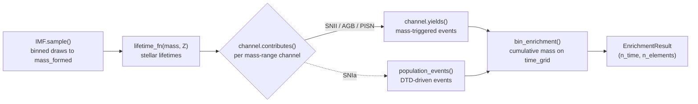

# Physics Overview

CRIMSONS turns a stellar population's basic properties -- an IMF, a total
mass formed, and a metallicity -- into the time-resolved mass of each of 30
elements returned to the interstellar medium. This section documents the
physical model behind each piece; the [API Reference](../api/index.md)
documents the corresponding code.

## Pipeline, per realization

`Simulation` repeats this for `n_realizations` independent, reproducibly
seeded draws and reports both the mean and the realization-to-realization
scatter -- the stochasticity comes from the IMF sampling itself (and, for
channels with stochastic model parameters, from those draws too).

## The pieces

- **[Initial Mass Function](imf.md)** -- the distribution stellar masses
  are drawn from, and how it's sampled.
- **[Stellar Lifetimes](lifetimes.md)** -- how long a star of a given mass
  and metallicity lives before it evolves off the main sequence.
- **[Enrichment Channels](channels.md)** -- which stars enrich the ISM,
  when, and with how much of each element.
- **[Metallicity & Population III](metallicity.md)** -- how a single
  metallicity threshold reshapes the IMF's default mass range, the
  lifetime formula, and which yield tables apply.
- **[Stochastic Sampling](sampling.md)** -- the binned Monte Carlo
  approach that makes realizations of $10^6\,M_\odot$ or more tractable.

## Scope

CRIMSONS computes the enrichment **source term**: how much of each element
a stellar population returns to the ISM, and when. Combining that with a
star-formation history, gas inflows/outflows, mixing, etc. into a full
one-zone (or multi-zone) chemical evolution model is left to the caller.
