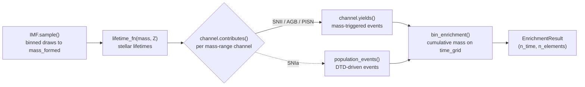

# Customize

CRIMSONS turns a stellar population's basic properties -- an IMF, a total
mass formed, and a metallicity -- into the time-resolved mass of each of 30
elements returned to the interstellar medium. Each page in this section
covers one piece of that pipeline twice over: **what it is** (the physical
model, ported/implemented as-is) and **how to change it** (which
constructor arguments to pass, and how to plug in something else
entirely). The [API Reference](../api/index.md) documents the
corresponding code in full; [Examples](../examples/basic-simulation.md)
walks through several of these customizations as complete, runnable
scripts.

## Pipeline, per realization

`Simulation` repeats the pipeline for `n_realizations` independent, reproducibly
seeded draws and reports both the mean and the realization-to-realization
scatter -- the stochasticity comes from the IMF sampling itself (and, for
channels with stochastic model parameters, from those draws too).

## The pieces

- **[Initial Mass Function](imf.md)**: the distribution stellar masses
  are drawn from and how it's sampled; swap in a different built-in shape,
  change the mass range, or supply your own shape function entirely.
- **[Stellar Lifetimes](lifetimes.md)**: how long a star of a given mass
  and metallicity lives before it evolves off the main sequence; plug in
  your own fit.
- **[Enrichment Channels](channels.md)**: which stars enrich the ISM,
  when, and with how much of each element; change a channel's mass
  window, pick a different SN Ia delay-time distribution, or write a new
  channel from scratch.
- **[Metallicity & Population III](metallicity.md)**: how the
  metallicity threshold reshapes the IMF's default mass range, the
  lifetime formula, and which yield tables apply, and how to override each of those independently.
- **[Stochastic Sampling](sampling.md)**: the binned Monte Carlo
  approach that makes realizations of $10^6\,M_\odot$ or more tractable,
  and the knobs (`n_bins`, `chunk_size`) that trade accuracy for speed.

Once you've changed a piece, [Output Interaction](../examples/output-interaction.md)
covers everything you can do with the `EnrichmentResult` that comes back
out.

## Scope

CRIMSONS computes the enrichment **source term**: how much of each element
a stellar population returns to the ISM, and when. Combining that with a
star-formation history, gas inflows/outflows, mixing, etc. into a full
one-zone (or multi-zone) chemical evolution model is left to the caller.

## Parallelization

CRIMSONS is natively parallelized and automatically adjusts the number of parallel jobs used based on the expected computational load of the simulation. It is also possible to pass the number of parallel jobs as n_jobs in the configuration phaze. The values of n_job are the maximum number of jobs. To use all the available cpus, set n_jobs to -1. The actual number of jobs used is set by the minimum between n_jobs and n_realizations.    
